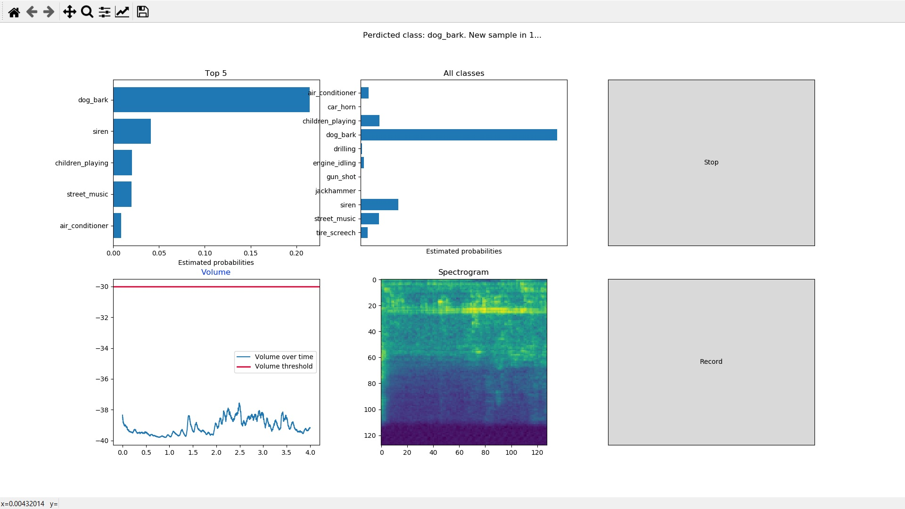

# V2 Sound Classifier v0.3 - Deploying the model on a Raspberry PI
Note: the steps below were taken on a Raspberry Pi 3 Model B+ with a fresh Raspbian Buster installation.

## 1. OS
Download **Raspbian Buster with desktop and recommended software** from [here](https://www.raspberrypi.org/downloads/raspbian/) and use BalenaEtcher to flash it to an sd card.

## 2. Install scripts
If you are using a clean Raspbian install on a Raspberry pi 2 or 3, it's easiest to try to install everything with the included install scripts.

### 2.1 Berryconda
Open a terminal, cd to the directory of this repository, and run 
```
./install_step_1.sh
```
The installation of berryconda will prompt for a few thing like accepting the terms and conditions.
 * When asked where to install berryconda, the default directory is fine.
 * **Important:** when asked if the install should prepend the Berryconda3 install location to PATH, choose yes. This will make the berryconda python3 the default one.

### 2.2 Python packages
To use the new python version we must close the terminal, open a new terminal and cd to the directory of this repository again.

Then run
```
./install_step_2.sh
```
If this script finishes without error, proceed to **Step 4**. 

## 3. Manual installation
If the scripts above fail or you want to know what's happening, follow these steps:

### 3.1 Berryconda
The easiest way to install all the necessary packages is to install Berryconda. 
We need Python 3 so also Berryconda3. See this [github readme](https://github.com/jjhelmus/berryconda#quick-start) for the right version.

For Raspberry Pi 2 and 3:
(Make sure the rapberry pi has a working internet connection.)
```shell
wget -P ~/Downloads/ "https://github.com/jjhelmus/berryconda/releases/download/v2.0.0/Berryconda3-2.0.0-Linux-armv7l.sh"
sudo ~/Downloads/Berryconda3-2.0.0-Linux-armv7l.sh
```

To install, you need to approve the licence terms. Then let berryconda install itself in the default location.

When asked if the install should prepend the Berryconda3 install location to PATH, choose yes. This will make the berryconda python3 the default one.

After this step, close the terminal window and open a new one.

### 3.2 Encoder, drivers
Install the necessary encoders and audio drivers:
```shell
sudo apt-get install ffmpeg libavcodec-extra libjpeg-dev zlib1g-dev portaudio19-dev
```

### 3.3 Numba
The most dificult package to install is librosa, because it's dependency numba depends on llvm-lite which will not easily install with pip3. We install it following [this guide](https://numba.pydata.org/numba-doc/dev/user/installing.html#installing-on-linux-armv7-platforms):

```shell
conda install -c numba numba
```

### 3.4 Other packages using conda
These packages can also be installed using conda:
```shell
conda install scipy numpy scikit-learn matplotlib h5py
```

#### 3.2.2 pip
Now we can install the rest of the packages through the standard python package manager *pip*. But to make sure pip finds the conda packages, we first install pip *inside* the conda environment:

```shell
conda install pip
```

Now check if the pip command refers to the right version:

```shell
which pip
```
If the output has `berryconda` in the path (e.g. `/home/pi/berryconda3/bin/pip`) we're good.

Now we can install the rest of the dependencies:
```shell
pip install librosa Keras==2.2.4 tensorflow==1.13.1 Pillow pydub pyaudio
```
(It may work with other versions of Keras and tensorflow as well, but these ones are tested.)

# 4. Audio input device
The raspberry pi has not built-in audio input. You'll need a usb audio card or a usb microphone to record sounds.

## 4.1 Test
Make sure that this device is plugged in and run
```
python test_audio.py
```
If all goes right, it should wait for 4 seconds and the print a text visualization of the recorded audio in the terminal.

## 4.2 Errors
If you get an error (like `Error opening input stream: Invalid sample rate`) perform the following steps:

```
python list_audio_devices.py
```

Look for you USB device in the list (e.g. `USB PnP Sound Device`) and write down the card number (e.g. `hw:1,0`)

Create or modify a file called `.asoundrc` in the home directory:

```
nano ~/.asoundrc
```

And write the following, replacing "hw:1,0" with the card number of your device from the previous step:

```
pcm.!default {
     type asym
     playback.pcm {
             type plug
             slave.pcm "hw:1,0"
     }
     capture.pcm {
             type plug
             slave.pcm "hw:1,0"
     } 
}
```

Save and exit (ctrl+x and Y) and try again:
```
python test_audio.py
```

# 5. Usage

## 5.1 GUI tool
The script `record_audio_gui.py` shows a GUI figure with the spectrogram, volume, the estimated class probabilities and buttons to stop and start storing the audio files:



When storing sounds, it will only store sounds if the peak volume exceeds the set threshold. It also stores additional information about the file in a json file included in the store folder.

```
python record_audio_gui.py -m <model filepath> -c <classes file filepath> -s <store sounds> -t <threshold> -l <store location>
```
With
 * `<model filepath>` The filepath of the .h5 model for spectrogram classification. (default: models/model_with_tire_screech.h5)
 * `<classes file filepath>` The filepath of the json file containing a list of class names. (default: models/ class_names_with_tire_screech.json)
 * `<store sounds>` Store the recordings that exceeded the volume threshold? ("y"/"n", default: "n")
 * `<threshold>` The volume threshold above which sounds will be stored if store is enabled. (number, default: -30)
 * `<store location>` The location where to store sounds if store is enabled. (default: stored/)

This script is quite demanding for small devices like a raspberry pi. It is adviced to start with this script to test if the audio is working and to choose a suitable volume threshold for storing sounds and then use the next script to start a longer recording:

## 5.2 CLI tool
The script `record_audio_cli.py` does the same but without a GUI window. Usage:

```
python record_audio_cli.py -m <model filepath> -c <classes file filepath> -s <store sounds> -t <threshold> -l <store location>
```
With
 * `<model filepath>` The filepath of the .h5 model for spectrogram classification. (default: models/model_with_tire_screech.h5)
 * `<classes file filepath>` The filepath of the json file containing a list of class names. (default: models/ class_names_with_tire_screech.json)
 * `<store sounds>` Store the recordings that exceeded the volume threshold? ("y"/"n", default: "n")
 * `<threshold>` The volume threshold above which sounds will be stored if store is enabled. (number, default: -30)
 * `<store location>` The location where to store sounds if store is enabled. (default: stored/)

